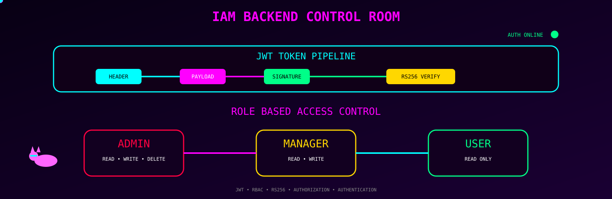
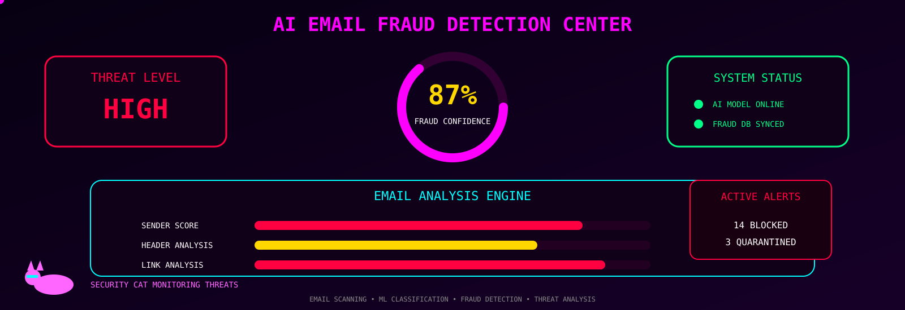
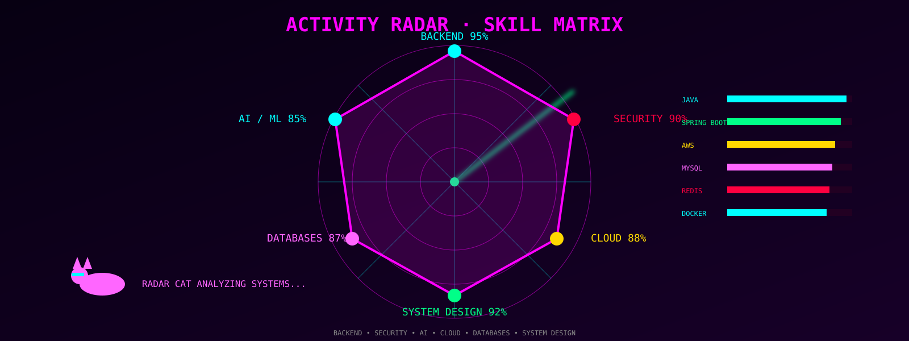
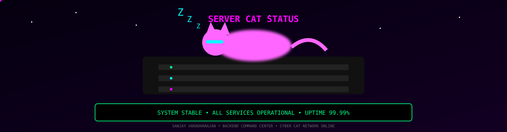

#  BACKEND COMMAND CENTER 

 

# SANJAY VARADHARAJAN

### Backend & Systems Engineer

 

---

# 🐈 CYBER INFRASTRUCTURE GUARDIANS

<table>
<tr>
<td align="center">

### 🐈 Cache Cat

Redis Guardian

</td>

<td align="center">

### 🐈 API Cat

Spring Protector

</td>

<td align="center">

### 🐈 Cloud Cat

AWS Overseer

</td>

<td align="center">

### 🐈 Database Cat

MySQL Keeper

</td>
</tr>
</table>

---

# ⚡ LIVE INFRASTRUCTURE

---

# ⚙ TECH ARSENAL

### Backend

### Database

### Cloud & DevOps

---

# 📊 COMMAND CENTER METRICS

---

# 🐍 CONTRIBUTION SNAKE

---

# 🔐 IAM BACKEND CONTROL ROOM

### Features

* JWT Authentication
* Role Based Access Control
* Email Verification
* Password Reset Workflows
* AWS EC2 Deployment
* Secure REST APIs

---

# 🤖 AI FRAUD DETECTION CENTER

### Features

* Fraud Confidence Scoring
* Gmail IMAP Integration
* ML Prediction Pipeline
* Security Analytics Dashboard
* Threat Detection Engine

---

# 🚀 PROJECT VAULT

### 🔐 IAM Backend System

Secure authentication platform powered by Spring Boot, JWT, MySQL and AWS.

### 🤖 AI Email Fraud Detection

AI-assisted fraud detection system with real-time threat analysis.

### 💼 Pathbros Job Portal

Personalized recommendation platform with location-aware matching.

---

# 🏆 ACHIEVEMENT HALL

<table>
<tr>
<td align="center">

## 🥇

### Catch-26 Winner

National Level Hackathon

</td>

<td align="center">

## 🏅

### Daksha 26

Honourable Mention

</td>
</tr>
</table>

---

# 📡 ACTIVITY RADAR

---

# 👁 PROFILE VISITS

---

# 📫 CONTACT TERMINAL

📧 [sanjay.jr096@gmail.com](mailto:sanjay.jr096@gmail.com)

🔗 LinkedIn: [www.linkedin.com/in/sanjay-varadharajan-sde](http://www.linkedin.com/in/sanjay-varadharajan-sde)

💻 GitHub: https://github.com/Sanjay-Varadharajan

🧩 LeetCode: https://leetcode.com/u/sanjay_Varadharjan/

---

### ◈ SERVER STATUS ◈

`SYSTEM STABLE`

`ALL SERVICES OPERATIONAL`

`UPTIME : 99.99%`

